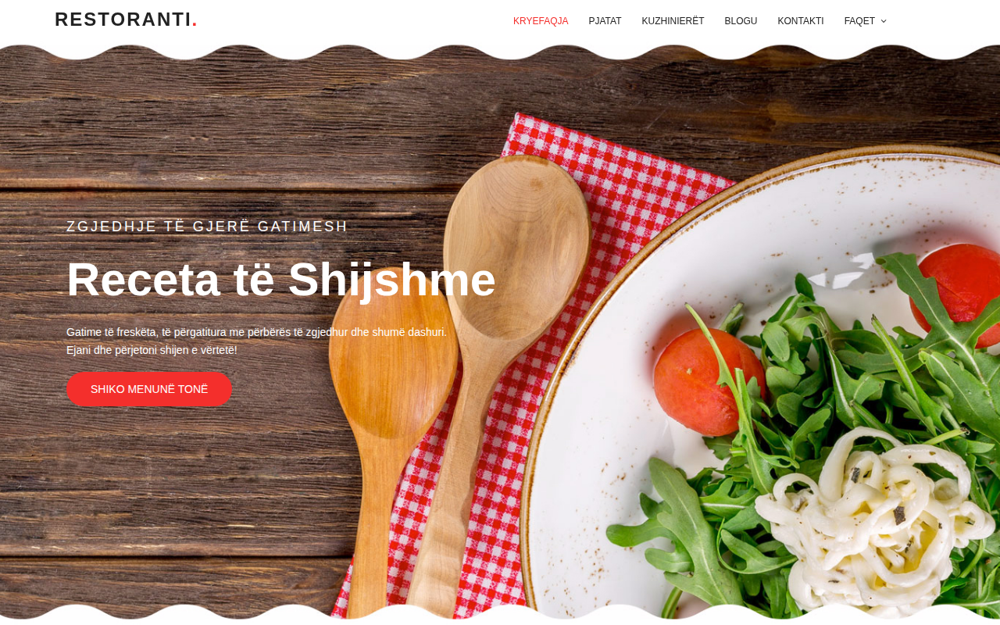

# Restoranti

Faqe prezantuese për restorant — me menu, galeri, ekipin e kuzhinës, blog dhe kontakt. Përshtatur plotësisht në **shqip**.

A restaurant landing page — with menu, gallery, kitchen team, blog and contact. Fully localized in **Albanian**.

## 🌐 Demo live

**https://erionnezha.github.io/Restaurant/**

## 📸 Pamje / Screenshot



## 📄 Përshkrimi

- **Kryefaqja** (`index.html`) — banner, pjatat më të vlerësuara, video, veçoritë, menutë e veçanta, ekipi i kuzhinës, blogu dhe kontakti
- **Faqja informative** (`generic.html`) — historia e restorantit dhe ekipi
- **Faqja e elementeve** (`elements.html`) — shembuj të komponentëve të dizajnit (butona, tabela, galeri, formularë)
- **Kontakti** — telefon, email dhe adresë direkte, me buton **mailto** dhe hartë të Tiranës

## ▶️ Si ta hapësh lokalisht

Thjesht hape `index.html` në shfletues — nuk kërkohet server:

```bash
cd Restaurant
# pastaj hap index.html me shfletuesin
```

## 🛠️ Teknologjitë

HTML5, CSS3 (Bootstrap 4), JavaScript (jQuery), Google Fonts (Poppins), Font Awesome, Owl Carousel, Magnific Popup.

## ⚠️ Shënim i rëndësishëm / Important note

Formulari origjinal i kontaktit përdorte `mail.php` (PHP), i cili **nuk funksionon në GitHub Pages** (vetëm faqe statike). Prandaj formulari është zëvendësuar me kontakte direkte dhe një buton **mailto:shembull@example.com**. Skedari `mail.php` mbahet në repo vetëm si referencë.

The original contact form used `mail.php` (PHP), which **does not work on GitHub Pages** (static hosting only). It has been replaced with direct contact details and a **mailto:shembull@example.com** button. `mail.php` is kept in the repo for reference only.

## 👤 Autori / Author

**Erion Nezha** — shembull@example.com

Dizajni bazohet në një template të Colorlib (CC BY 3.0), me tekst dhe përmbajtje të përshtatura në shqip.
Design based on a Colorlib template (CC BY 3.0), with text and content localized in Albanian.

## 📜 Licenca / License

MIT — shih skedarin [LICENSE](LICENSE).
